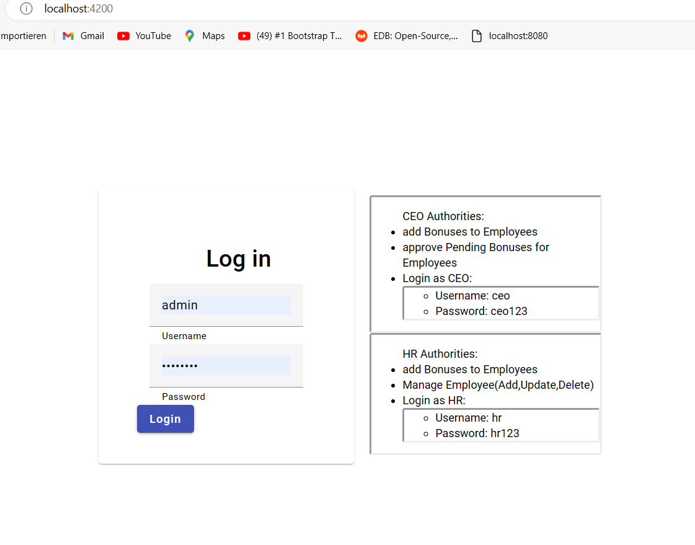
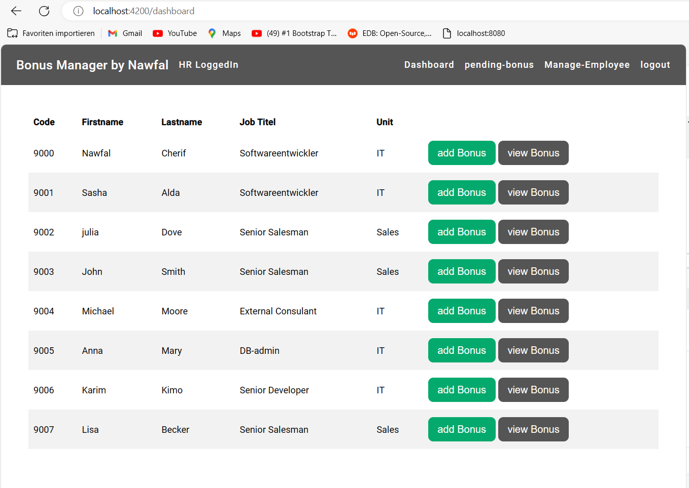
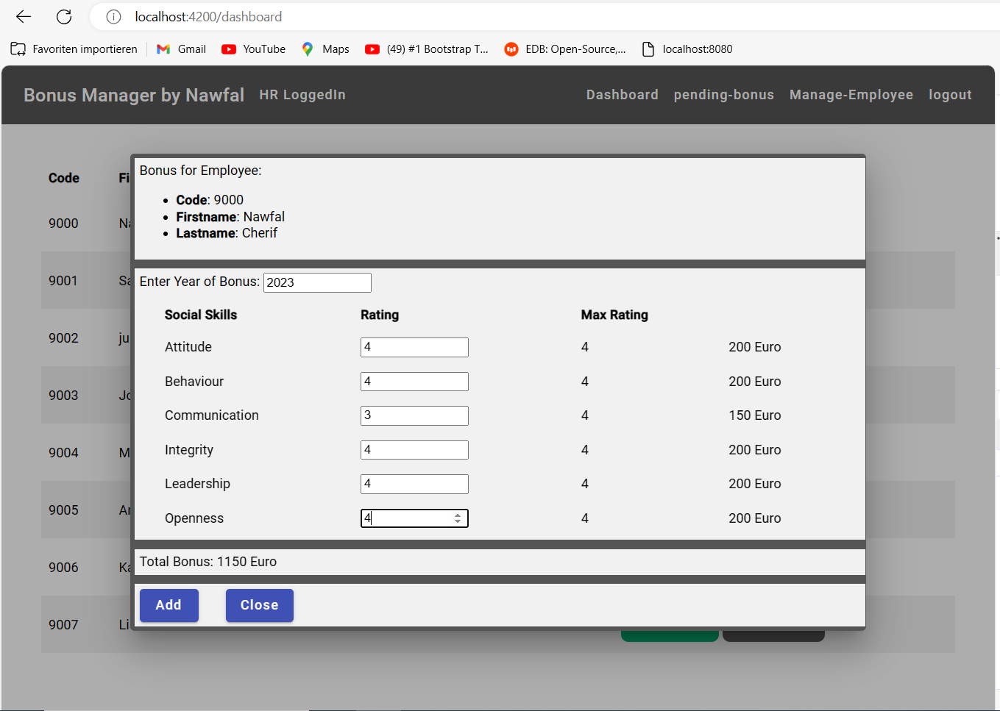
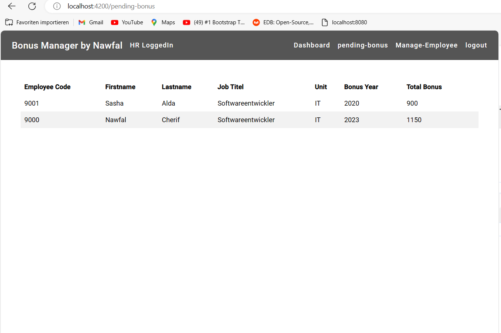
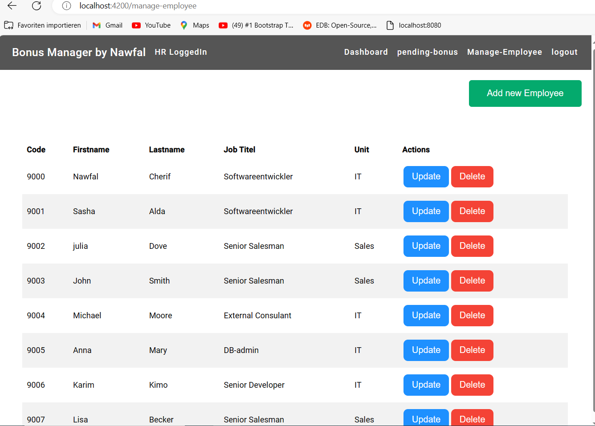
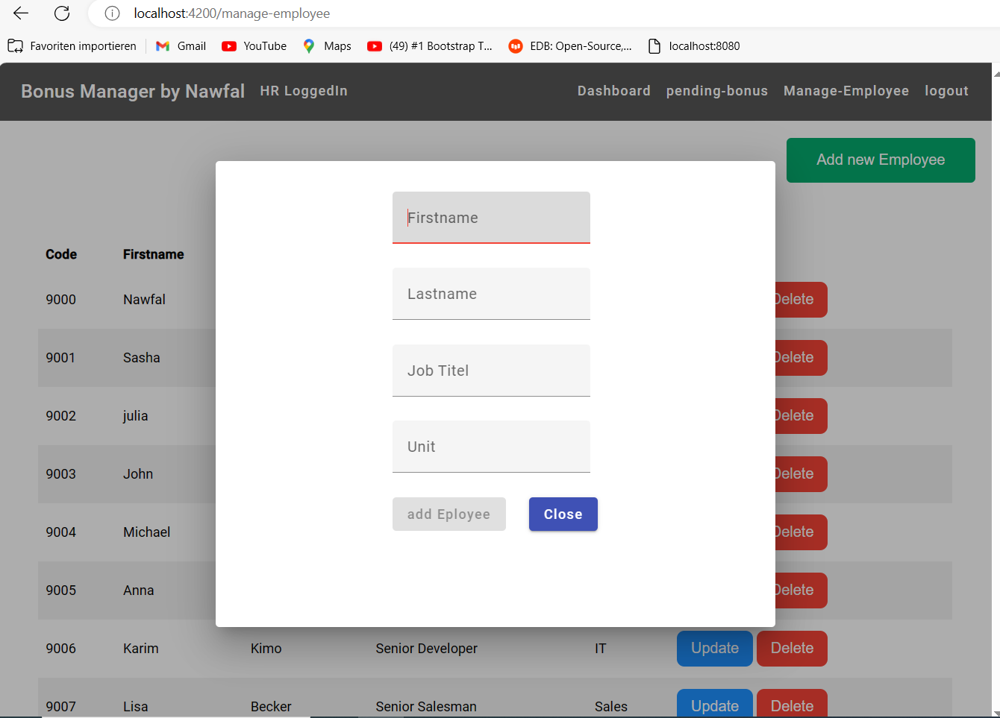
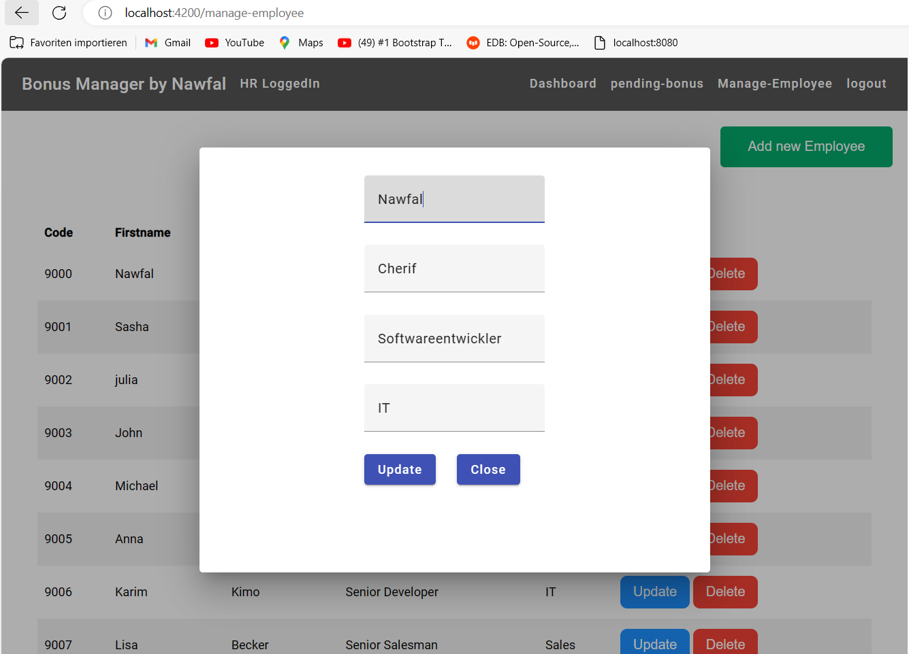

<h1>Bonus Manager App</h1>

 Bonus manager ist eine Applikation, die die Bonusse für die Personal in der Firma anhand der Bewertung ihren soziale Leistungen rechnet. 

Der Projekt ist fullstack implementiert,das Backend mit Java Frameworke Spring boot und ProstgeSQL als Datenbank, und Frontent mit Angular 16 .

Die Benuzung der App erfolgt nach dem Einlogen, man kann sich mit Rollen als CEO oder als HR einlogen, und jenach Rolle hat man bestimmte Autoritäten.

<h3>Login view:</h3>

<h3>HR Views:</h3>

--------------------

HR kann Bonusse für die Mitarbeiter rechnen und in der Warteliste zur Bestätigung durch CEO schicken,sie darf neue Mitarbeiter im System hinzufügen updaten oder löschen 

<h3>HR Dashboard View:</h3>

<h3> Add Bonus View:</h3>

Der max Bewertung ist 4 und min ist 0, das Formulare soll komplette ausgefüllt werden sont die "add" Button wird nicht aktiviert. Der Preis für jede Bewertung und der Bonus wird Automatisch von der App gerechnet.

<h3>pending-bonus View</h3>

<h3>Manage-Employees View:</h3>

<h3>Add Employee View:</h3>

<h3>Update Employee View</h3>

