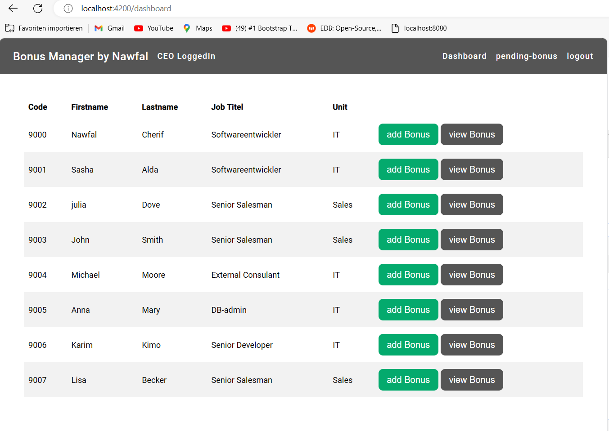
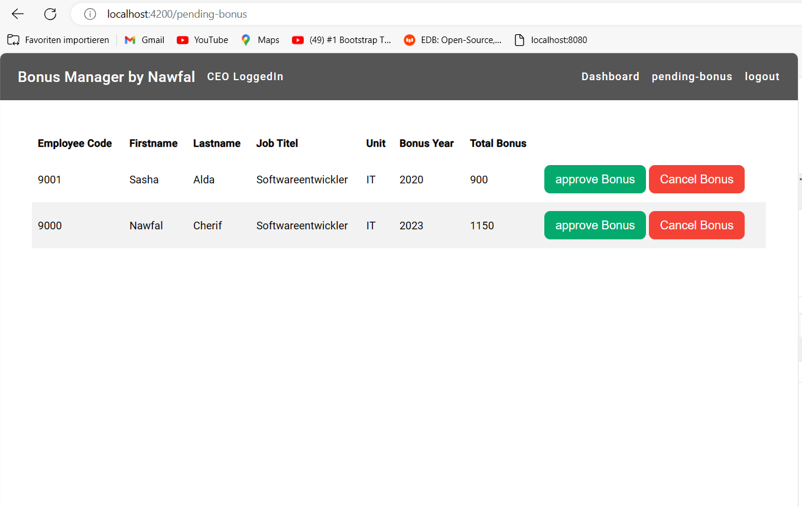
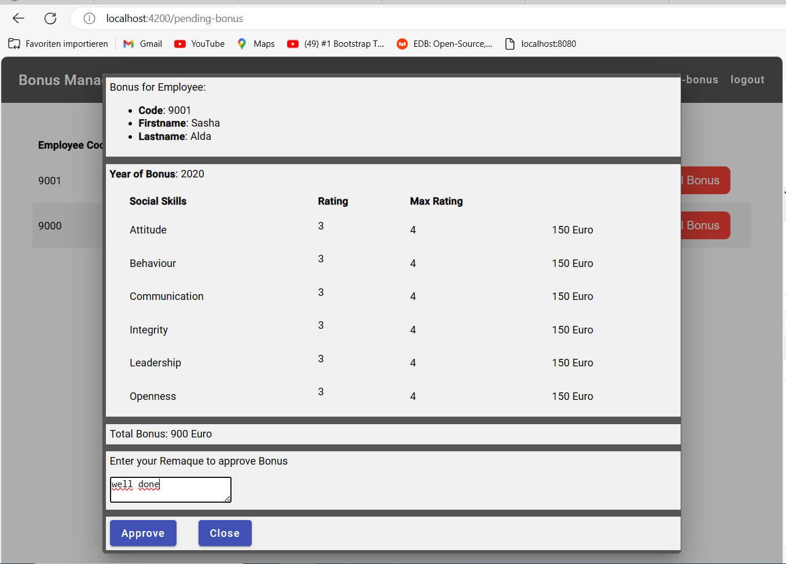

<h1>Bonus Manager App</h1>

 Bonus manager ist eine Applikation, die die Bonusse für die Personal in der Firma anhand der Bewertung ihren soziale Leistungen rechnet. 

Der Projekt ist fullstack implementiert,das Backend mit Java Frameworke Spring boot und ProstgeSQL als Datenbank, und Frontent mit Angular 16 .

 Die App ist zurzeit auf Amason aws Cloude verfügbar. 

<ul>
  Bonus Manager App unter der Link:
  <li><a href="http://bonusmanager.s3-website.eu-central-1.amazonaws.com" target="_blank">Bonus-Manager</a></li>
</ul>

<ul>
  REST-API Dokumentation unter der Link:
  <li><a href="http://bonus-manager.eu-central-1.elasticbeanstalk.com/swagger-ui/index.html" target="_blank">Bonus-Manger Rest API Backend</a></li>
</ul>

Die Benuzung der App erfolgt nach dem Einlogen, man kann sich mit Rollen als CEO oder als HR einlogen, und jenach Rolle hat man bestimmte Autoritäten.

<h3>Login view:</h3>

nach erfolreiches Einlogen, schickt der Backend die Rolle des eingelogten Users als Responce DTO, Angular speichert der Responce im Browser LocalStorage, und führt der Eingelogter zum passenden Dashboard 

<h3>HR Views:</h3>

--------------------

HR kann Bonusse für die Mitarbeiter rechnen und in der Warteliste zur Bestätigung durch CEO schicken,sie darf neue Mitarbeiter im System hinzufügen updaten oder löschen 

<h3>HR Dashboard View:</h3>

<h3> Add Bonus View:</h3>

Der max Bewertung ist 4 und min ist 0, das Formular soll komplett ausgefüllt werden sont die "add" Button wird nicht aktiviert. Der Preis für jede Bewertung und der Bonus wird Automatisch von der App gerechnet.

<h3>pending-bonus View</h3>

<h3>Manage-Employees View:</h3>

<h3>Add Employee View:</h3>

<h3>Update Employee View</h3>

<h3>CEO Views:</h3>

--------------------

<h3>CEO Dashboard View:</h3>

CEO kann auch Bonusse für die Mitarbeiter rechnen, die tatsächliche Rolle des CEO ist aber die Bonusse, die von HR gerechnet sind,bestätigen oder absagen. 

<h3>pending-bonus View:</h3>

<h3>Aprove Bonus View:</h3>

CEO muss eine Anmerkung im eingabefeld Remark schreiben, damit die "approve" Button aktiviert wird.

